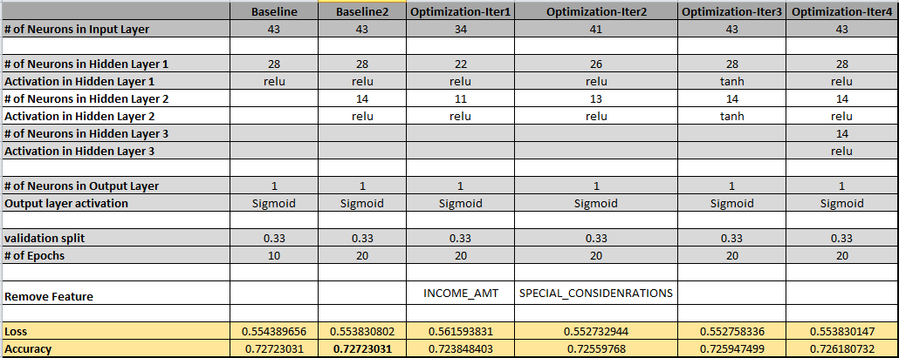

# Charity Analysis using Neural Network

The goal of the project is to build a binary classifier model with atleast 75% accuracy that predicts whether an application asking for funding from Alphabet Soup will be successful or not using machine learning and neural networks.
 

The [data file]("Resources\charity_data.csv") contains more than 34,000 organizations that have received funding from Alphabet Soup over the years. Within this dataset are a number of columns that capture metadata about each organization, such as the following:

- EIN and NAME—Identification columns
- APPLICATION_TYPE—Alphabet Soup application type
- AFFILIATION—Affiliated sector of industry
- CLASSIFICATION—Government organization classification
- USE_CASE—Use case for funding
- ORGANIZATION—Organization type
- STATUS—Active status
- INCOME_AMT—Income classification
- SPECIAL_CONSIDERATIONS—Special consideration for application
- ASK_AMT—Funding amount requested
- IS_SUCCESSFUL—Was the money used effectively
 
 

## Results

### Data Preprocessing
- ***What variable(s) are considered the target(s) for your model?*** 
  IS_SUCCESSFUL is considered for target variable  
- ***What variable(s) are considered to be the features for your model?*** 
  AFFILIATION, CLASSIFICATION, ORGANIZATION, USE_CASE, STATUS, INCOME_AMT, SPECIAL_CONSIDERATIONS and ASK_AMT values are considered for feature variables.  
- ***What variable(s) are neither targets nor features, and should be removed from the input data?*** 
  EIN and NAME were neither targets nor features were considered for the models and hence were removed from the final input data set.  
### Compiling, Training, and Evaluating the Model
- ***How many neurons, layers, and activation functions did you select for your neural network model, and why? ***
  Following the guidelines from https://www.heatonresearch.com/2017/06/01/hidden-layers.html, I decided to choose number of neurons for first hidden layer as 2/3rd of input layer neurons. The input layer neurons are equal to the train data feature size. 
  For subsequent hidden layers, I considered half of neurons from the preceding layer. 
  I used a sigmoid activation on the output layer to ensure our network output is between 0 and 1. 
  For input and hidden layers, I used ReLu activation because it provided slightly better accuracy than tanh.

- ***Were you able to achieve the target model performance?*** 
  Unfortunately, I was not able to achieve the target accuracy of 75%. The best accuracy that I was able to achieve for the model is 72.7%.  
  
- ***What steps did you take to try and increase model performance?*** 
  The table below shows different trials and parameter tuning that I performed to improve the accuracy of the model. Unfortunately, none of the models provided a better accuracy than the baseline model. 
   
  
  Note: 
   The 2 baseline models are in [AlphabetSoupCharity.ipynb](AlphabetSoupCharity.ipynb) as github versions. The 4 iterations of optimization attempts are in [AlphabetSoupCharity_Optimization.ipynb](AlphabetSoupCharity_Optimization.ipynb) as github versions.  

   The final baseline model is saved in [AlphabetSoupCharity.h5](AlphabetSoupCharity.h5). The final iteration model is saved in [AlphabetSoupCharity_optimization.h5](AlphabetSoupCharity_optimization.h5). 

## Summary
As it is evident from various iterations that the accuracy of the model didn't improve with any parameter tuning. What is more interesting is that with every model the loss metric is more than 50%. This could mean that the input data might need extra pre-processing.  
As a next step, I would first look at relation between each of the features and determine if one feature is strongly associated with other. This might be skewing the input to the model.  
I would also try few Ensemble classifier models like RandomForest as these tend to work better for classification problems such as the one we are trying to solve.